# X16Emu ADD — the Advanced Disassembler and Debugger for the Commander X16


[](https://github.com/xylothan/x16-emulator/actions/workflows/build.yml)
[](https://github.com/xylothan/x16-emulator/releases)
[](https://github.com/xylothan/x16-emulator/releases/tag/dev)
[](./LICENSE)
[](https://github.com/xylothan/x16-emulator/graphs/contributors)


**X16Emu ADD** — the **A**dvanced **D**isassembler and **D**ebugger — is a fork of the
[official Commander X16 emulator][upstream] built for people who write software for the X16
rather than just run it. It is the upstream emulator with a real debugger bolted on: a dockable
graphical debug UI, source-level debugging from cc65 `.dbg` files, and a Debug Adapter Protocol
server so the machine can be driven from VS Code, Visual Studio, or any other DAP-speaking editor.

Everything the official emulator does, ADD does too.

> ### ⚠️ This is experimental software
>
> The emulator core is upstream and is great, but **the debugger, the DAP server and the
> Windows-specific changes are experimental** and probably not great. Expect rough edges, and
> expect details to change between releases.  
>
> That said it has been used successfully to carry several real Commodore 64 to X16 porting
> projects through to completion, which is exactly the work it was built for. Anyone debugging
> assembly on the X16 today will very likely save time with it.  This software is purpose built
> to further personal projects and make my life easier.  If it makes your life easier, great!
>
> **It is published as-is, and is not formally supported at this time.**

Why X16Emu ADD
---------------

|  |  |
| --- | --- |
| **Graphical debugger** | A dockable Dear ImGui debug window with disassembly, CPU, memory, source, call stack, symbols, breakpoints, I/O and file access, and VERA/PSG/FM/PCM inspectors. |
| **Source-level debugging** | Point it at a cc65 `.dbg` file and step through the original `.s`/`.c` source, with labels, equates and live values. `.dbg` files auto-load, including for overlays the program `LOAD`s at runtime. |
| **Debug from an editor** | A built-in DAP server means breakpoints, stepping, watches, memory and disassembly in VS Code, Visual Studio, or any DAP-speaking client. |
| **Conditional breakpoints** | Break on `A == $05`, `byte[$1234] != 0`, a specific RAM bank, or the Nth hit. |
| **Watchpoints** | Break on writes to an address or a whole range, with up to 64 of them. |
| **Scriptable input** | Inject keystrokes, typed text and joystick state over DAP, making automated regression runs of a game practical. |
| **VERA inspectors** | Live palette, tile, sprite, bitmap and tilemap viewers plus fully decoded VERA registers — decoded per scanline, so raster splits are visible. |
| **65C816 / GS aware** | 24-bit bank:address memory browsing, mode-correct register widths, and the X16 virtual registers R0–R15 broken out. |
| **Real Windows builds** | Self-contained statically linked `x16emu.exe` for x64, x86 and ARM64. No SDL2, zlib or Visual C++ redistributable to install. |
| **The window doesn't freeze** | On Windows the emulator keeps running and painting while its window is dragged or resized. |
| **Automated releases** | Every push is built for all platforms; tagging stages a draft release with all the assets attached, ready for a human to publish. |

[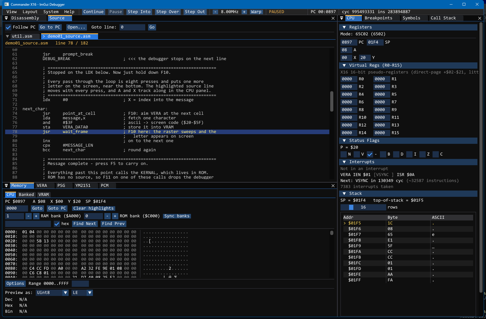](./.gh/screenshots/debugger-overview.png)

*Stopped mid-loop in a cc65 assembly program: your own source on the left with the current line
highlighted, 65C816-aware registers and the X16 virtual registers `R0`–`R15` on the right, and a
live hex editor underneath. Every panel is dockable, and the machine keeps running in its own
window while you inspect it.*

The debugger is documented in full, panel by panel and with a screenshot of each, under
[Advanced Debugging](#advanced-debugging) below.

Relationship to the official emulator
-------------------------------------

ADD exists to add debugging tooling, not to diverge from the X16 platform. It has no relation
to upstream development. Don't bug the upstream developers about it.

**Everything about the Commander X16 itself — the KERNAL, BASIC, VERA, the hardware, the file
formats — is documented officially, and those docs apply here unchanged:**

* [Official X16 documentation][x16docs] — the reference for the machine, its KERNAL and BASIC
* [x16-rom][x16rom] — the KERNAL/BASIC ROM sources
* [Official emulator][upstream] — upstream, whose release notes cover the emulator core each ADD build is based on
* [commanderx16.com][website]

Use the official docs for the machine. Use this README for what ADD adds on top.

### Version and release numbering

Releases are named **`R49.nnn`**:

* `R49` names the official Commander X16 release line the build follows. It is not a promise of
  byte-for-byte equivalence with official R49: the emulator core tracks upstream's ongoing
  development after that release, so a build may include upstream fixes made since R49 was cut.
* `nnn` counts the ADD builds on top of it, and goes up as ADD's own features land.

When upstream cuts its next release, ADD releases move to `R50.001` and so on. A release is cut by
pushing an `R49.nnn` **tag**, which is what the build workflow keys on; if you also want a branch
for a release line, give it a distinct name such as `release/R49.001`, since a branch and a tag
sharing one name makes `R49.001` ambiguous to git.

Each release package ships the `rom.bin` it was built and tested against — use that one. Older ROMs
may not work with newer emulators, and vice versa.

Features
--------

Inherited from the official emulator:

* CPU: 65C02 and 65C816 instruction sets, selected by command line switch
* VERA
    - Mostly cycle exact emulation
    - Supports almost all features:
        - composer
        - two layers
        - sprites
        - VSYNC, raster, sprite IRQ
* Sound
    - PCM
    - PSG
    - YM2151
    - MIDI via FluidSynth
* Real-Time-Clock
* NVRAM
* System Management Controller
* SD card: reading and writing (image file)
* VIA
    - ROM/RAM banking
    - keyboard
    - mouse
    - gamepads

Added by ADD:

* Dear ImGui graphical debugger (`-imgui`)
* Debug Adapter Protocol server for editor-based debugging (`-debugport`)
* cc65 source-level debugging (`-dbgfile`, `-srcpath`)
* Conditional breakpoints, hit counts and memory watchpoints
* Statically linked MSVC builds for Windows x64/x86/ARM64
* Non-blocking window drag and resize on Windows

Binaries & Compiling
--------------------

Binary releases for macOS, Windows and Linux are available on the [X16Emu ADD releases page][releases].
The official builds, which have upstream's keyboard-driven debugger but none of ADD's tooling, are
[over here][upstream-releases].

### Which Windows download?

Windows ships in three flavours. Unless you have a reason to pick otherwise, take `x16emu_win64`.

| Package | What it is |
| --- | --- |
| `x16emu_win64`, `x16emu_win32`, `x16emu_win-arm64` | A single self-contained `x16emu.exe`, statically linked. Nothing to install — no SDL2, zlib or Visual C++ redistributable. Built without FluidSynth, so it offers no MIDI options at all. |
| `…-midi` | A separate build with FluidSynth compiled in, shipped with `libfluidsynth-3.dll` for the MIDI synth (`-midicard` / `-sf2`). Take this if you want MIDI. |
| `x16emu_win64-mingw`, `x16emu_win32-mingw` | The older MinGW build, kept as a fallback. Ships MIDI support and the `-trace` option, at the cost of around 25 DLLs alongside the executable. |

All of them include the debugger and the DAP server.

### Development builds

Every check-in to `main` refreshes the [`dev` prerelease][dev-release], so there is always a
current build to download without waiting for a tagged release. It is not an official release and
carries no promises, but it is built and unit-tested by the same workflow that cuts the real ones.

The tag and the file names never change, so a link keeps working as the build rolls forward:

```
https://github.com/xylothan/x16-emulator/releases/download/dev/x16emu_win64-dev.zip
https://github.com/xylothan/x16-emulator/releases/download/dev/x16emu_linux-x86_64-dev.zip
https://github.com/xylothan/x16-emulator/releases/download/dev/x16emu_macos_m1-dev.zip
```

Swap in any package name from the table above. Which build you actually have is recorded three
ways: in the release title, in `BUILD_VERSION.txt` inside the zip, and on the last page of the
bundled `README.pdf`. They all read the same identifier, for example:

```
r49-dev-20260810.003
```

That is the upstream release this fork sits on, the UTC date, and how many commits landed that
day — so `.003` is the third check-in of the tenth.

Two differences worth knowing about the default builds:

- The non-`-midi` packages are built without FluidSynth, so they do not offer the MIDI options
  at all — they will not appear in `-h`, and dropping the DLL next to one will not enable them.
- The MSVC builds have no `-trace` option. The generated ROM listing contains a string literal
  larger than MSVC's 16 KB limit, so a trace-enabled build cannot compile. Use the `-mingw`
  package if you need `-trace`.

The emulator itself is dependent only on SDL2. However, to run the emulated system you will also need a compatible `rom.bin` ROM image. This will be
loaded from the directory containing the emulator binary, or you can use the `-rom .../path/to/rom.bin` option.

> **WARNING:** Older versions of the ROM might not work in newer versions of the emulator, and vice versa.

You can build a ROM image yourself using the [build instructions][x16rom-build] in the [x16-rom][x16rom] repo. The `rom.bin` included in the [*latest* release][releases] of the emulator may also work with the HEAD of this repo, but this is not guaranteed.

### Building from source

The emulator depends on SDL2. The debugger and DAP server add two more requirements:

* a **C++17** compiler, because Dear ImGui and the debug UI are written in C++ (Dear ImGui itself is
  vendored in `src/extern/imgui/`, so there is nothing to install for it), and
* **cJSON**, used by the DAP server — `libcjson-dev` on Debian/Ubuntu, `cjson` on Homebrew,
  or supplied by vcpkg on Windows.

Both the ImGui debugger and the DAP server are always compiled in; `-imgui` and `-debugport`
are runtime switches, so there is nothing to enable at build time.

### macOS Build

Install SDL2 using `brew install sdl2`, and cJSON using `brew install cjson`.

### Linux Build

The SDL2 development package is available from the package repositories of most major Linux distributions:
- Red Hat: `yum install SDL2-devel cjson-devel`
- Debian: `apt-get install libsdl2-dev libcjson-dev`

Type `make` to build the source. The output will be `x16emu` in the current directory. Remember you will also need a `rom.bin` as described above.

### WebAssembly Build

Steps for compiling WebAssembly/HTML5 can be found [here][webassembly].

### Windows Build

The Windows releases are built with **MSVC and CMake**, using vcpkg for dependencies and custom
triplets in `vcpkg-triplets/` that link everything statically. That is what produces the
self-contained `x16emu.exe` in the release packages:

```
cmake -B build -G "Visual Studio 17 2022" -A x64 ^
  -DCMAKE_TOOLCHAIN_FILE=%VCPKG_INSTALLATION_ROOT%/scripts/buildsystems/vcpkg.cmake ^
  -DVCPKG_OVERLAY_TRIPLETS=vcpkg-triplets ^
  -DVCPKG_TARGET_TRIPLET=x64-windows-x16emu ^
  -DCMAKE_MSVC_RUNTIME_LIBRARY=MultiThreaded ^
  -DENABLE_TRACE=OFF
cmake --build build --config Release
```

Use `-A Win32` with `x86-windows-x16emu`, or `-A ARM64` with `arm64-windows-x16emu`, for the other
architectures. Add `-DENABLE_FLUIDSYNTH=ON -DVCPKG_MANIFEST_FEATURES=midi` for a MIDI build.
`ENABLE_TRACE` must stay off under MSVC: the generated ROM listing contains a string literal
larger than MSVC's 16 KB limit.

The output is `build\Release\x16emu.exe` and `build\Release\makecart.exe`. Remember you will also
need a `rom.bin` as described above.

Cross-compiling from macOS/Linux/MSYS2 with mingw-w64 also still works. Install the mingw-w64
toolchain and the mingw32 version of SDL, then:
```
CROSS_COMPILE_WINDOWS=1 MINGW32=/usr/x86_64-w64-mingw32 WIN_SDL2=/usr/x86_64-w64-mingw32 make
```
Paths to those libraries can be changed to your installation directory if they aren't located there.

The output will be `x16emu.exe` in the current directory. You will also need `SDL2.dll` from SDL2's binary folder.


Starting
--------

You can start `x16emu`/`x16emu.exe` either by double-clicking it, or from the command line. The
latter allows you to specify additional arguments. When starting `x16emu` without arguments, it
will pick up the system ROM (`rom.bin`) from the executable's directory.

The command line options of the official emulator work here too — `-prg`, `-bas`, `-run`, `-scale`,
`-sdcard`, `-fsroot`, `-warp`, `-gif`, `-wav`, `-ram`, `-c816` and the rest. They are documented in
the [official emulator's README][upstream-readme]. Two caveats, both from the packaging rather than
from ADD itself: the MSVC builds have no `-trace`, and the non-`-midi` packages have no MIDI
options at all. `x16emu -h` is the authoritative list for the build you actually have.

The options below are the ones ADD adds on top. They all concern debugging.

| Option | What it does |
|---|---|
| `-imgui` | Opens the graphical debugger in its own window, with dockable panels for the CPU, memory, disassembly, source, breakpoints, symbols, the call stack, VERA graphics, the three audio sources, and I/O ports and file access. Additive: independent of, and combinable with, `-debug`. |
| `-debugport [<port>]` | Starts the Debug Adapter Protocol server so an IDE can attach. Default port 9009. |
| `-bp <address>` | Arms a breakpoint before the first instruction runs, for catching start-up code you could never attach to in time. Can be repeated. Needs a debugger to resume from, so it opens `-debug` unless `-imgui` or `-debugport` is already giving you one. See [Catching early boot with `-bp`](#catching-early-boot-with--bp). |
| `-dbgfile <path>` | Loads a cc65 `.dbg` file, so addresses map back to source files and line numbers. |
| `-dbgauto` / `-no-dbgauto` | Whether to merge the `.dbg` beside each program the machine loads. Follows the debugger unless forced either way. |
| `-srcpath <dir>` | Adds a directory to search for the source files a `.dbg` names. Can be repeated. |

Upstream's `-debug [<address>]` still works. ADD does not extend it; see the
[official README][upstream-readme] for what it does.

All of these are covered properly under [Advanced Debugging](#advanced-debugging).

Using the emulated machine
--------------------------

Running the X16 itself — the keyboard layouts, BASIC and the screen editor, SD card images, the
host filesystem interface, GIF and WAV recording, the emulator I/O registers at `$9FB0`-`$9FBF`,
the CRT cartridge format, the `makecart` tool, and the WebEmulator's URL options — is identical
to the official emulator and is documented there. ADD changes none of it.

* [Official emulator README][upstream-readme] — command line options, recording, I/O registers,
  SD card images, HostFS, the CRT format and `makecart`
* [Official X16 documentation][x16docs] — the machine itself, its KERNAL and BASIC
* [WebAssembly notes][webassembly] — building the web target

The emulator hotkeys (`Ctrl`+`F` for fullscreen, `Ctrl`+`M` for mouse capture, `Ctrl`+`R` to
reset, `Ctrl`+`V` to paste, and so on, or their command-key equivalents on macOS) are upstream's
and are unchanged. ADD adds a few of its own, listed under
[Keyboard shortcuts](#keyboard-shortcuts).


Advanced Debugging
------------------

This is the part of the emulator ADD exists for. There are two ways to debug, and they are
additive — either or both can be turned on:

| You want | Use | Start with |
| --- | --- | --- |
| A graphical debugger with panels, source view and VERA inspectors | **ImGui debugger** | `-imgui` |
| To debug from VS Code / Visual Studio / a script | **DAP server** | `-debugport` |

Upstream's own small keyboard-driven debugger (`-debug`) is still present and still works, but
ADD does not extend it and it is documented [upstream][upstream-readme]. Everything below
describes the ImGui debugger and the DAP server.

A good default for day-to-day assembly work:

```
x16emu -imgui -prg myprog.prg -run
```

A good default when your source is built with cc65:

```
x16emu -imgui -prg myprog.prg -run -dbgfile myprog.dbg -srcpath ./src
```

> ⚠️ The ImGui debugger and the DAP server are **experimental and probably broken**. They have
> helped complete several real C64→X16 porting projects, but treat the debugger like a goat that
> eats your homework: if something looks funny, assume it is doing something wrong until you can
> prove otherwise. Expect rough edges and occasional changes to keys, layouts and DAP details
> between releases.

#### Using the debugger and an editor at the same time

Breakpoints live in one place. Whether a breakpoint came from `-bp` on the command line, F9 in
the debugger, the ImGui breakpoints panel, or your editor over DAP, there is a single table
deciding where the machine stops, and each of those can hold a breakpoint at the same address
without disturbing the others. Disconnecting your editor takes away the breakpoints *it* asked
for and leaves yours alone.

The emulator's own UIs share one view of that table: a breakpoint you set with F9 appears in the
ImGui panel, and one you disable there still shows in the Disassembly and Source gutters.

An editor attached over DAP is the exception, because it keeps its own list:

* A breakpoint you set with F9 will not appear in your editor's gutter.
* A breakpoint you delete with F9 goes away in the emulator, but your editor still believes in
  it — and because DAP clients re-send a source file's whole breakpoint list whenever you edit
  it, your editor will usually put it back.

This is a limitation of the protocol rather than an oversight: in DAP the client owns its
breakpoint list and is expected to be authoritative about it. If you are driving the emulator
from an editor, the least surprising approach is to manage breakpoints from the editor and treat
F9 as a local, temporary override.

### The ImGui debugger

`-imgui` opens a second, resizable OS window titled **"Commander X16 - ImGui Debugger"**,
960×720, placed next to the emulator window. It is available in the native Windows, Linux and
macOS builds.

It does not require `-debug`, and it does not replace the emulator window — the machine keeps
running in its own window while you inspect it.

#### Panels

Every panel is dockable, closable and reopenable from the **View** menu. Each one is shown in
[A tour of the panels](#a-tour-of-the-panels) below.

| Panel | What it gives you |
| --- | --- |
| [**Disassembly**](#disassembly) | Live disassembly around the PC. Hovering an operand shows the effective address and the value there. Right-click for *Run to here* and *Toggle breakpoint*. |
| [**CPU**](#cpu-virtual-registers-and-the-stack) | Registers with 65C816-aware widths, decoded status flags, and the stack with the most recent push on top. A collapsible **Virtual Regs (R0–R15)** section shows the X16 pseudo-registers at `$02`–`$21`. A collapsible **Watch** section holds your own address watches — bank-qualified, up to 16 bytes each, editable, with hex/decimal/binary tooltips. |
| [**Memory**](#memory) | A hex editor with three tabs: **CPU** (the CPU map), **Banked** (browse any RAM bank at `$A000`–`$BFFF`) and **VRAM** (VERA's full 17-bit address space). Drag to select a range, search by hex bytes or ASCII with Find Next/Prev, jump to an address, and watch changed bytes flash. Right-click to *Add to watch*, *Add range to watch*, *Copy address*, *Break on write* or *Clear selection*. Edits go through the normal write path, so I/O side effects happen and watchpoints fire. |
| [**Source**](#source-level-stepping) | Your original `.s`/`.c` source in tabs, with the current line highlighted and centred on each stop. For C, stepping moves a whole statement at a time rather than an instruction. Right-click for *Run to here* and *Toggle breakpoint*. **Open…** pre-loads a file so you can set breakpoints before the PC ever gets there. Hovering a label or number resolves it to an address and its live value. |
| [**VERA**](#vera-graphics-debugging) | Six tabs: **Registers** (all 32 registers `$9F20`–`$9F3F`, fields decoded), **Palette**, **Tiles**, **Sprites**, **Bitmap** and **Tilemap**. Each view decodes using the registers that actually rendered each scanline, so raster splits show up correctly rather than being flattened to the end-of-frame state. |
| [**Breakpoints**](#breakpoints) | Every breakpoint, with its condition and hit count. Enable, disable or delete individually. |
| [**Symbols**](#symbols) | A filterable list of every label from your `.dbg`, with live values. Right-click to *Go to*, *Toggle breakpoint* or *Run to here*. |
| [**Call Stack**](#call-stack) | A heuristic 65xx stack unwind. Frames are named after the nearest enclosing label, so even code without debug info gets a useful name. Click a frame to jump there in both source and disassembly. |
| [**PSG**](#psg--veras-16-voice-sound-generator) | VERA PSG voices with live register values, plus scope traces. |
| [**YM2151**](#ym2151--the-fm-chip) | FM channel state and scope traces. |
| [**PCM**](#pcm--the-audio-fifo) | VERA PCM state and scope traces. |
| [**I/O**](#watching-io-and-file-access) | What the machine is doing to its ports. An **Activity** log of register accesses and decoded device events, each row naming and explaining the register it touched; **SD Card** command, block and status state; **Files** — every file the machine has opened, by name, on either file path; **Joysticks** with buttons decoded and lit live; **VIA**, **I2C** (with the SMC and RTC behind it) and **Serial**, each annotated with what the bits are wired to. |

While the machine is paused, the audio panels keep drawing their scope traces by projecting from
the current register state, so you can see what a voice *would* be doing at the moment you stopped.

#### Toolbar

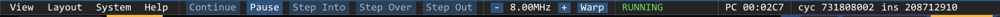

Along the top, after the menus: **Continue**, **Pause**, **Step Into**, **Step Over**,
**Step Out** (each greyed out when it does not apply and each showing its shortcut in the
tooltip), then the speed control, then a status readout.

The speed control shows the emulated clock as a real number — `1.75MHz`, `800kHz`, or `warp` —
rather than a percentage, coloured blue below native speed, **red above it**, and orange in warp
mode. `-` and `+` step the speed, `1x` returns to the machine's own clock, and `Warp` removes the
limit entirely.

The status readout shows `RUNNING`/`PAUSED`, an `IRQ` marker (with nesting depth) while the PC is
inside an interrupt handler, the 24-bit PC as `KK:PPPP`, and the elapsed cycle and instruction counts.

#### Menus

* **View** — show or hide any panel.
* **Layout** — *Reset to Default Layout* reopens everything and rebuilds the default docking arrangement.
* **System** — *Reset* (`Ctrl+Shift+F5`, keeps your breakpoints), *Trigger IRQ*, *Trigger NMI*, and *Settings…*.
* **Help** — the keyboard shortcut table, so you never need this README for it.

**Settings…** covers interrupt following, break-on-interrupt, whether a break auto-switches you to
the Disassembly or Source panel, memory change highlighting and its duration, holding audio while
paused, I/O capture and its per-device gating, and the global interface scale. Settings and your
window layout are saved to `imgui.ini` and restored next run.

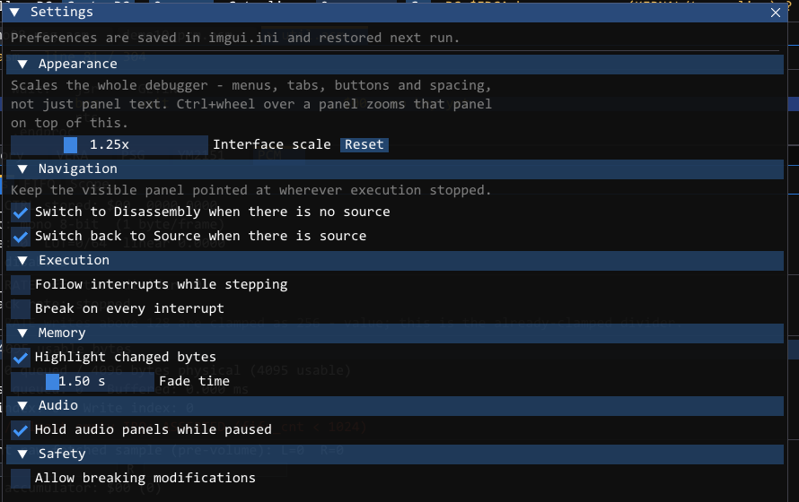

#### Keyboard shortcuts

Active when the debugger window has focus and you are not typing into a search or goto box.

| Key | Action |
| --- | --- |
| `F5` | Continue (while paused) |
| `Break` / `Pause` | Pause (while running) |
| `F11` | Step into |
| `Shift`+`F11` | Step out |
| `F10` | Step over |
| `Ctrl`+`F10` | Run to cursor |
| `F9` | Toggle a breakpoint at the PC |
| `Ctrl`+`Shift`+`F5` | Reset the machine, keeping breakpoints |
| `Ctrl`+`Mouse wheel` | Zoom the font of the panel under the cursor |

On macOS these are the physical `Control` and `Shift` keys, not `Command`.

These work in the emulator window and are handy while debugging graphics:

| Key | Action |
| --- | --- |
| `Ctrl`+`F3` | Toggle VERA layer 0 |
| `Alt`+`F3` | Toggle VERA layer 1 |
| `Shift`+`F3` | Toggle sprites |
| `Shift`+`F8` | Toggle KERNAL skip |

### A tour of the panels

Every screenshot below comes from one session: a cc65 assembly program built with `ca65 -g`, run as

```
x16emu -imgui -prg demo.prg -run -dbgfile demo.dbg -srcpath src
```

#### Source-level stepping

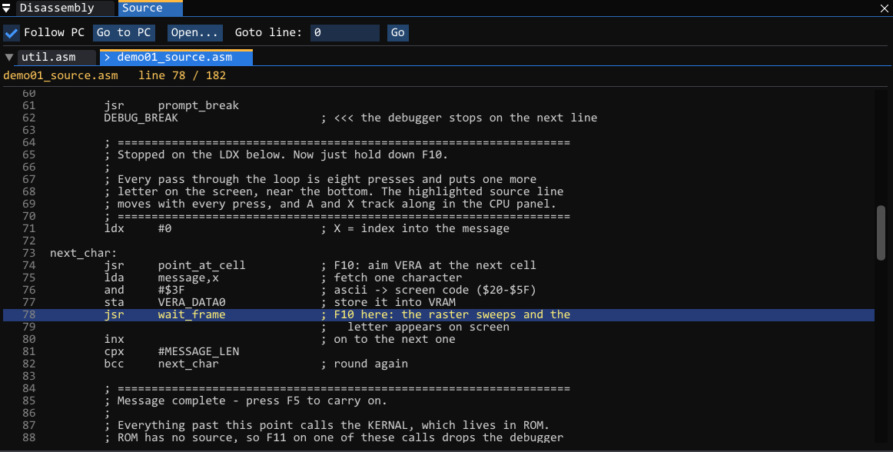

The Source panel shows the file the PC is actually in — comments, labels, original formatting and
all — with the current line highlighted and centred on every stop. Files open as tabs and the panel
switches between them on its own as execution crosses module boundaries, so a program split across
a dozen `.s` files needs no bookkeeping from you.

`F10` walks the highlight down the loop an instruction at a time while `A` and `X` track along in
the CPU panel. **Open…** pre-loads a file the PC has not reached yet, so you can arm a breakpoint
before it ever gets there, and hovering a label or a literal resolves it to an address and its
live value.

#### Disassembly

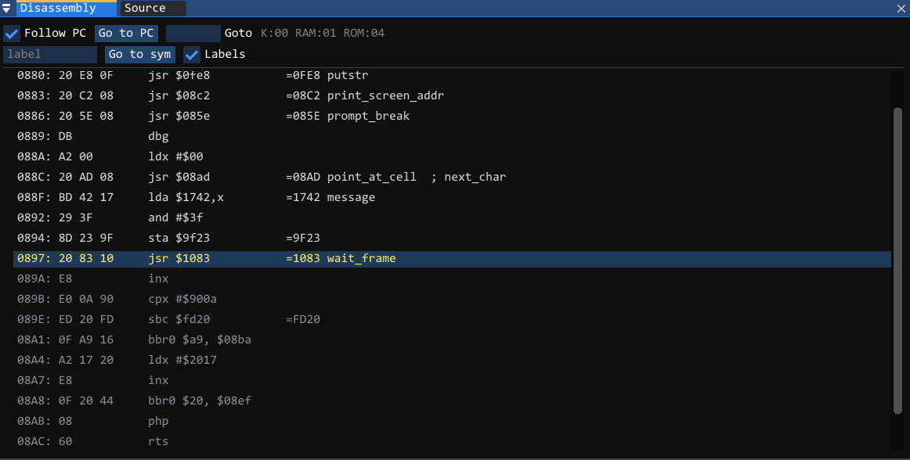

When the PC lands somewhere the debug info does not cover — KERNAL ROM, a trampoline, someone
else's binary — the Disassembly panel takes over. Every operand is resolved to its effective
address and annotated with the symbol living there (`=08AD point_at_cell`), so ROM code reads
almost as well as your own. Right-click any line for *Run to here* or *Toggle breakpoint*.

Which panel comes to the front on a break is a preference, not a rule: **Settings…** can switch to
Disassembly whenever there is no source and switch back when there is.

#### Call stack

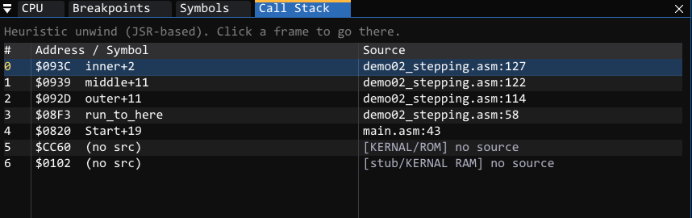

The 65C02 has no frame pointer, so this is a heuristic unwind of the hardware stack — but it is a
useful one. Each frame is named after the nearest enclosing label and resolved back to a source
file and line, and frames that fall outside your debug info are still labelled with where they are
(`[KERNAL/ROM]`, `[stub/KERNAL RAM]`) rather than dropped. Click any frame to send both the Source
and Disassembly panels to it.

#### Symbols

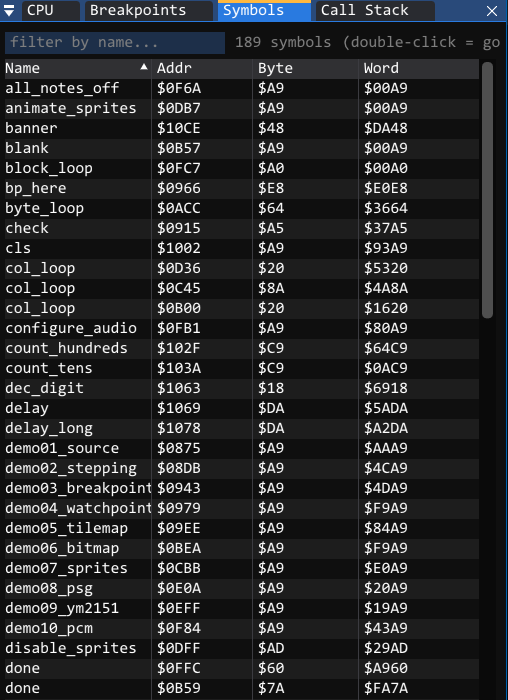

Every label from the `.dbg`, filterable by name, each with its address and the byte and word
currently living there. Double-click to go to a symbol; right-click for *Toggle breakpoint* or
*Run to here*.

#### CPU, virtual registers and the stack

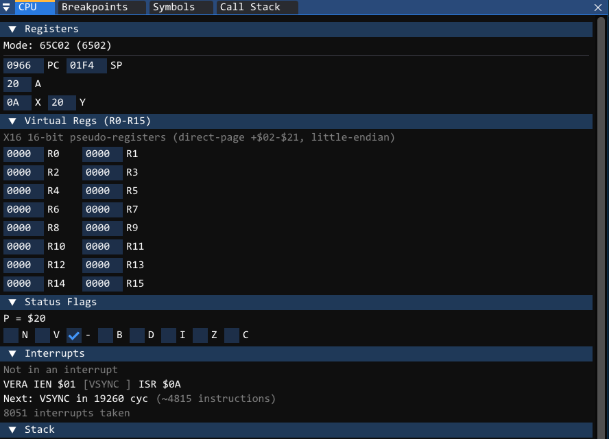

Registers are shown at the width the CPU is actually using — the panel is 65C816-aware, so `A`,
`X` and `Y` widen and narrow with the `M` and `X` flags instead of always reading as eight bits.
Status flags are broken out as individual checkboxes, and every field is editable in place.

Two things here are specific to the X16. **Virtual Regs (R0–R15)** decodes the sixteen 16-bit
pseudo-registers the KERNAL and cc65 keep at `$02`–`$21`, so you read `R3` rather than working out
which zero-page pair that was. The **Interrupts** block reports whether you are currently inside a
handler and how deep, the VERA `IEN`/`ISR` state, and how many cycles remain until the next VSYNC.

Below that sit the stack, most recent push first, and a **Watch** section for your own
bank-qualified address watches — up to 16 bytes each, editable, with hex/decimal/binary tooltips.

#### Memory

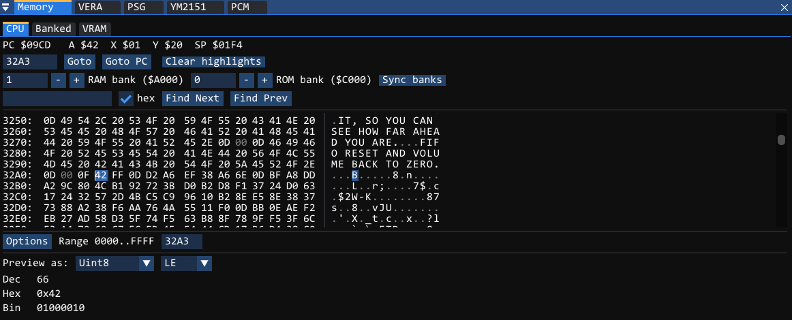

Three tabs: **CPU** for the processor's view, **Banked** for any RAM bank at `$A000`–`$BFFF`, and
**VRAM** for VERA's full 17-bit space. Jump to an address, search by hex bytes or ASCII, drag to
select a range, and watch bytes flash as they change. The selection is decoded underneath as
decimal, hex and binary in the type of your choosing.

Edits go through the emulator's normal write path rather than poking the array behind its back, so
I/O side effects happen and watchpoints fire exactly as they would have if the program had done it.

#### Breakpoints

Set one by clicking the gutter in the Source or Disassembly panel, pressing `F9` at the PC, or
right-clicking the line:

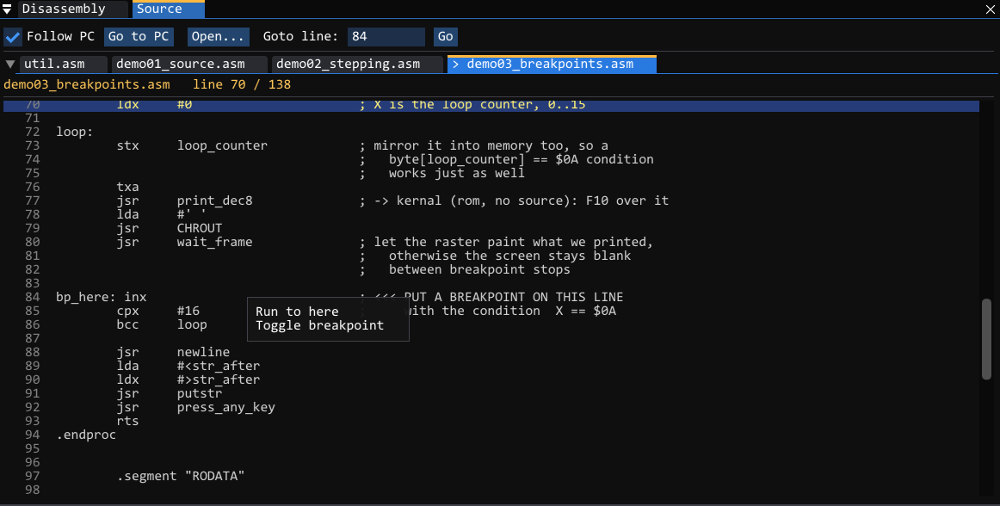

##### Conditions and hit counts

A breakpoint that fires on all sixteen passes of a loop is rarely what you want. Every breakpoint
carries an optional condition and ignore count, editable from the Breakpoints panel — no DAP client
required:

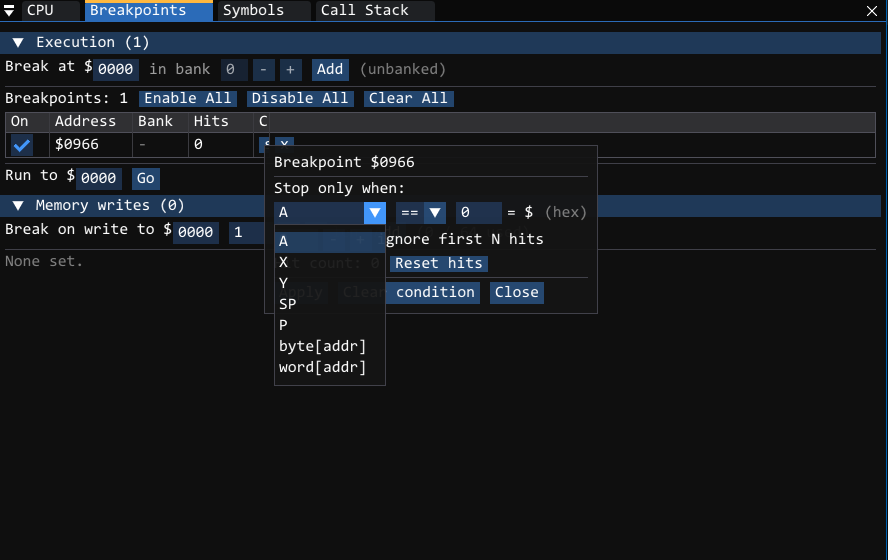

The left operand is a register (`A`, `X`, `Y`, `SP`, `P`) or memory (`byte[addr]`, `word[addr]`);
the comparison and the value complete it. The value box is **hex** — it is labelled with a `$` —
so `$0A` is decimal ten:

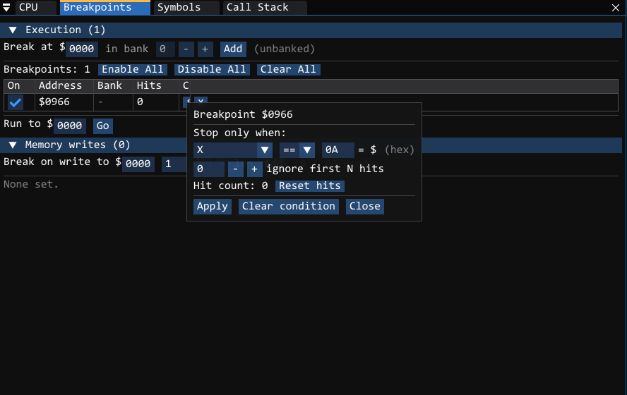

Run, and the loop stops on exactly the pass you asked for — the eleventh, with the emulator having
printed `0` through `10` and `X` still reading `$0A` because the `INX` has not happened yet:

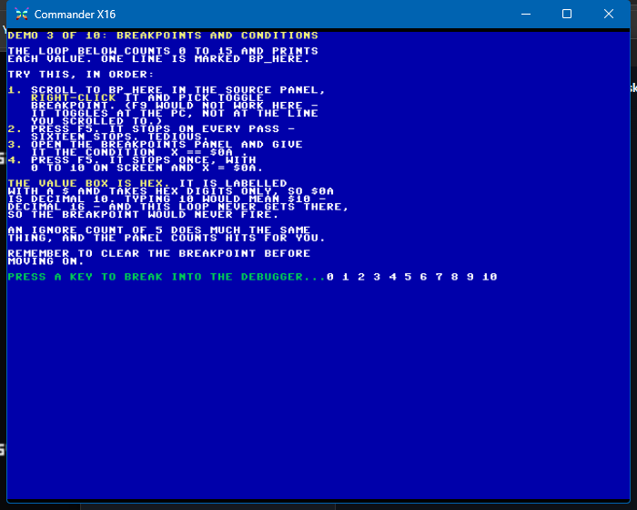

The panel lists every breakpoint with its bank, hit count and condition, and has both a
**Memory writes** section for watchpoints and a *Run to* box:

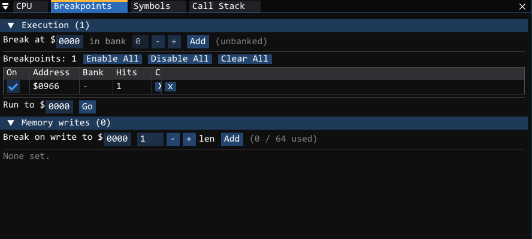

Conditions and hit counts set from a DAP client appear here too, and vice versa; the DAP syntax is
documented under [Remote debugging with DAP](#remote-debugging-with-dap).

##### Catching early boot with `-bp`

Every other way of setting a breakpoint needs the machine to already be up and you to already be
looking at it. `-bp` is the one that does not: it arms the breakpoint *before the first
instruction runs*, which is the only way to stop inside something that has already finished by
the time you could click a gutter — a `.prg` that runs from its load address, KERNAL or ROM code
during start-up, or anything reached from the reset vector.

The usual pairing is with the graphical debugger, so the machine is already stopped at the
interesting place when the window appears:

```
x16emu -imgui -prg myprog.prg -run -bp C000
```

It composes the same way with the other front ends, and can be repeated:

```
x16emu -imgui -bp C000 -bp 05:A000        # several, one pinned to RAM bank 5
x16emu -debugport -bp C000                # stop at boot, attach an editor afterwards
x16emu -bp C000                           # no front end named, so -debug opens
```

A breakpoint is no use without something able to resume from it, so `-bp` opens the text
debugger when you have not asked for another front end. Name `-imgui` or `-debugport` and it
leaves your choice alone. `-wp <address>[,<length>]` works the same way for writes.

The breakpoint belongs to the command line, not to whichever debugger displays it. It shows up
in the Breakpoints panel and to a DAP client, and neither can take it away — a client
disconnecting leaves it exactly where you put it. Deleting it is a deliberate act: `F9` on the
line, or the bin in the Breakpoints panel.

#### Watchpoints — break on write

A breakpoint stops when the PC reaches an address. A watchpoint stops when the *program writes to
memory*, which is how you find what is corrupting a variable when you have no idea which code is to
blame. Right-click any byte in the Memory panel — or drag-select a range first, for up to 64 active
watchpoints:

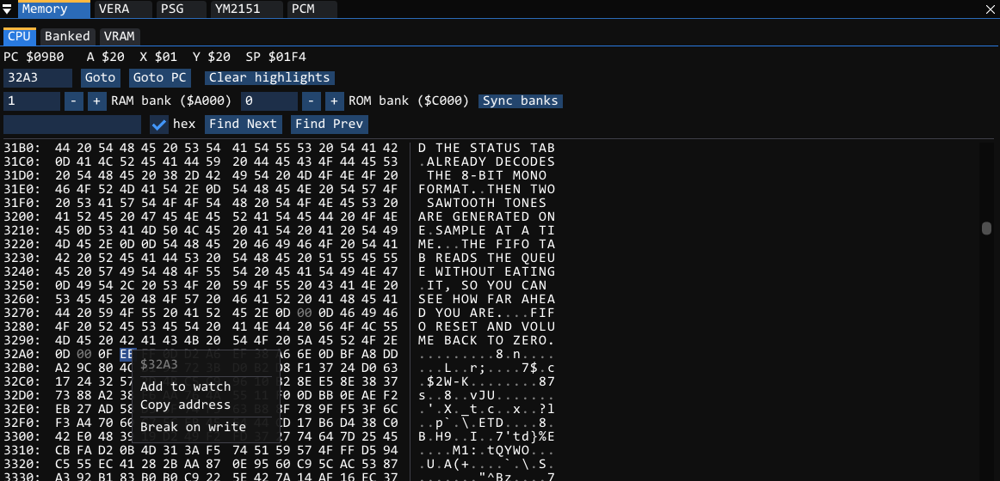

Each watchpoint can carry a value filter, so you stop only when a particular value is written
rather than on every store:

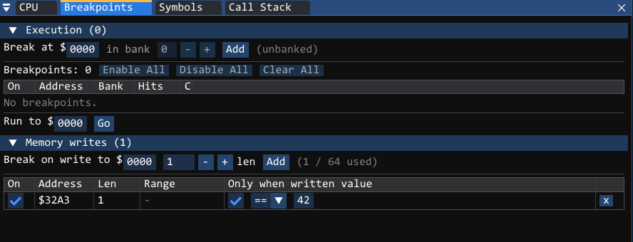

Run, and the eight earlier writes (`01 02 04 08 10 20 40 80`) pass straight through:

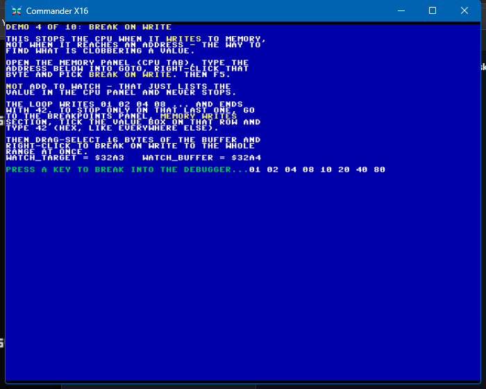

Execution stops on the instruction after the store that actually mattered:

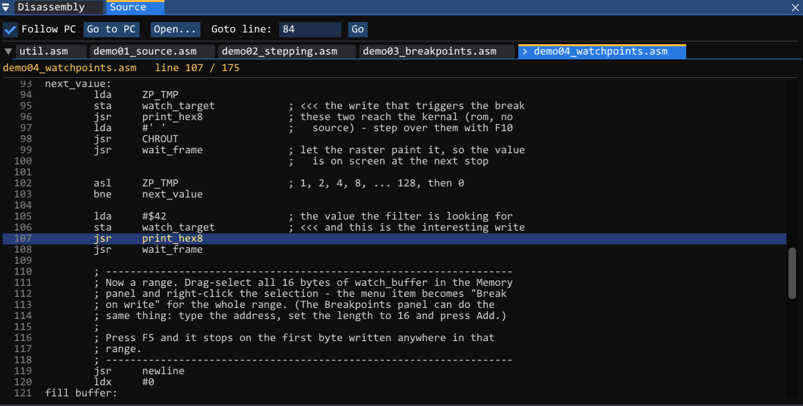

> **A note on names.** The debugger deliberately avoids the word *watchpoint* in the UI, because
> the CPU panel's **Watch** list already means something else — addresses you are keeping an eye
> on, which never stop execution. In the UI it is *Break on write* in the Memory panel's
> right-click menu and **Memory writes** in the Breakpoints panel.

#### VERA graphics debugging

The VERA panel has six tabs. All of them read the chip directly rather than the finished frame, so
they are live and correct even while the machine is stopped and the emulator window is showing a
stale image — and crucially, each view decodes using the registers that actually rendered each
scanline, so **raster splits show up as raster splits** instead of being flattened to whatever the
registers happened to hold at end of frame.

##### Registers

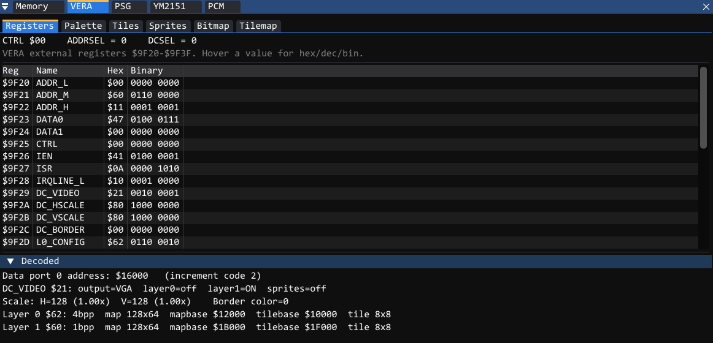

All 32 registers at `$9F20`–`$9F3F` in hex and binary, plus a **Decoded** block that spells out
what they add up to: the data port address and increment, output mode, which layers and sprites are
on, scaling, border colour, and each layer's depth, map size, map base, tile base and tile size.

##### Palette

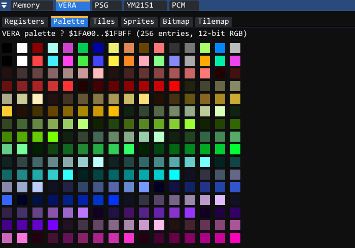

All 256 entries from `$1FA00`–`$1FBFF` as swatches. Hover one for its index and 12-bit RGB value.

##### Tiles

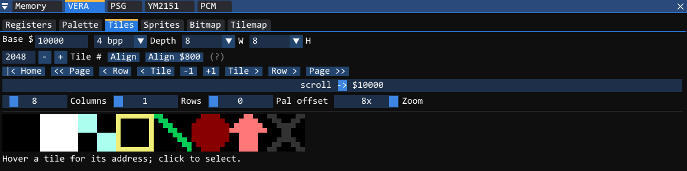

Decodes VRAM as tiles at whatever base address, depth, size, palette offset and zoom you point it
at, so you can confirm your art landed correctly before anything is drawn with it. Hover a tile for
its address; click to select.

##### Tilemap

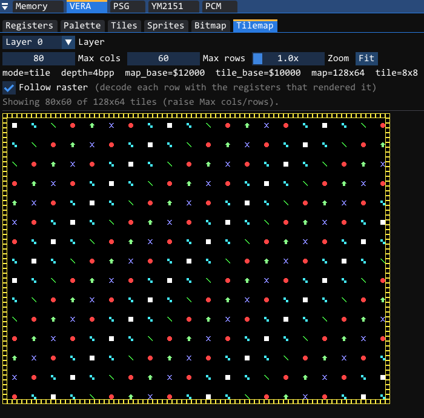

Renders a layer's map through that layer's own registers — the same tile base, map base, map size
and depth the hardware is using. **Follow raster** decodes each row with the registers that were in
force when that row was drawn, which is what makes mid-screen register changes visible.

Here is the same map on the emulated display a moment later, once layer 0 was switched on and the
text layer's opaque background was cleared:

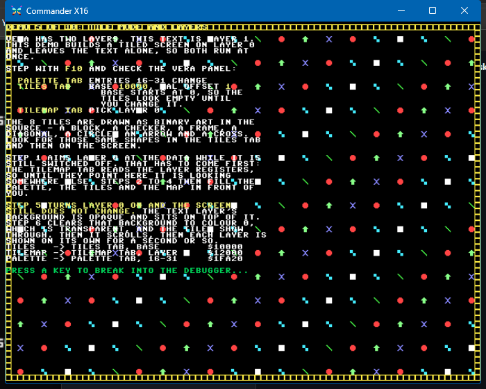

##### Sprites

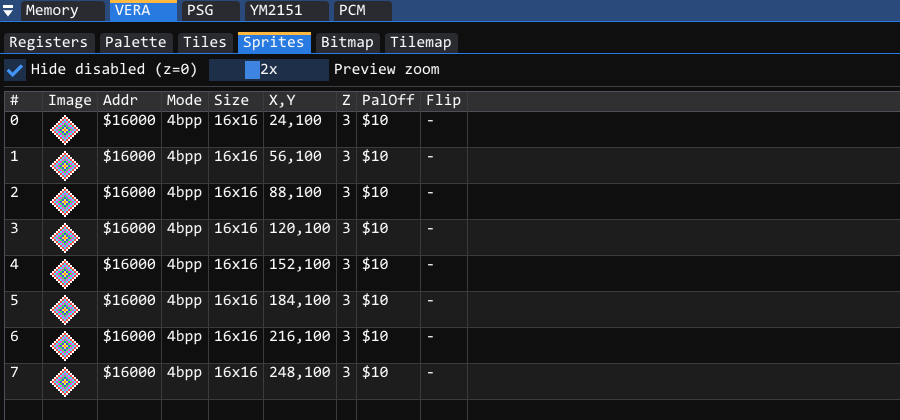

All 128 sprite records at `$1FC00`, fully decoded: a rendered preview of each sprite's image, its
data address, colour depth, size, X/Y position, Z-depth, palette offset and flip bits. **Hide
disabled** collapses the list to just the sprites that are actually live.

##### Bitmap

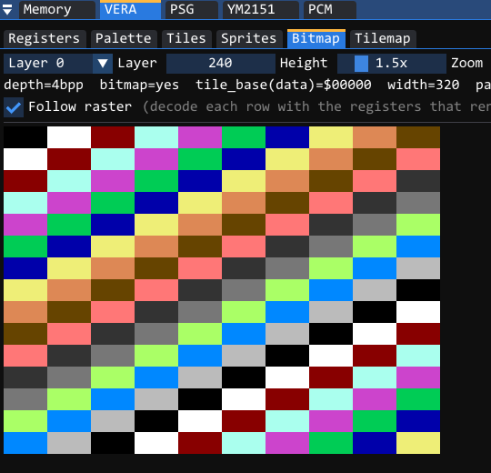

Decodes a bitmap-mode layer straight out of VRAM at the width, height and zoom you choose. Because
it reads VRAM rather than the display, the image is visible while it is still being written and
before the layer has been switched on at all.

#### Audio debugging

All three sound sources get a panel, and each shows raw register state, a decode of what that state
*means*, and scope traces. While the machine is paused the panels keep drawing by projecting from
the current register state, so you can see what a voice *would* be doing at the moment you stopped
— the **Hold audio panels while paused** setting controls this.

##### PSG — VERA's 16-voice sound generator

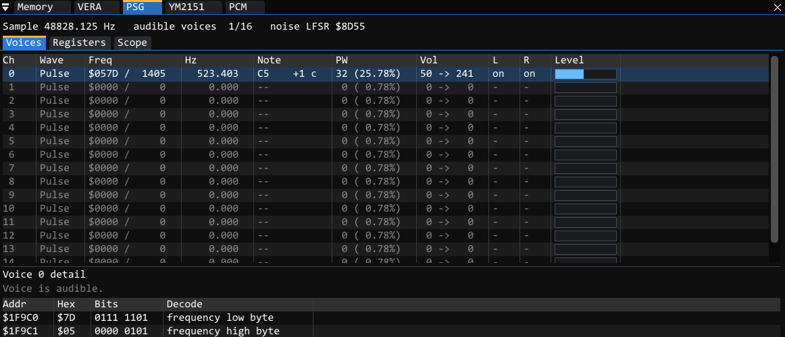

Every one of the 16 voices, with the raw frequency word decoded to Hz *and* to the nearest note
with its cents error, the waveform, pulse width as a duty percentage, the volume both raw and after
the hardware's lookup table, pan, and a live level meter. Selecting a voice expands the four
registers behind it byte by byte. There are also **Registers** and **Scope** tabs, the latter with
a trace per voice plus the summed output.

##### YM2151 — the FM chip

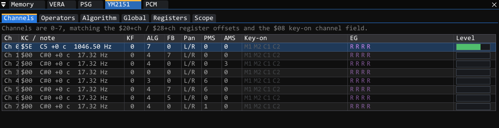

All eight channels with their key code decoded to a note and a frequency, algorithm, feedback,
pan, PMS/AMS, per-operator key-on state, envelope phase and output level.

The **Algorithm** tab is the one worth knowing about: it draws the operator routing for the
selected channel from the registers that were actually written, and box brightness follows live
envelope attenuation, so you can watch a patch sound rather than reading its bytes.

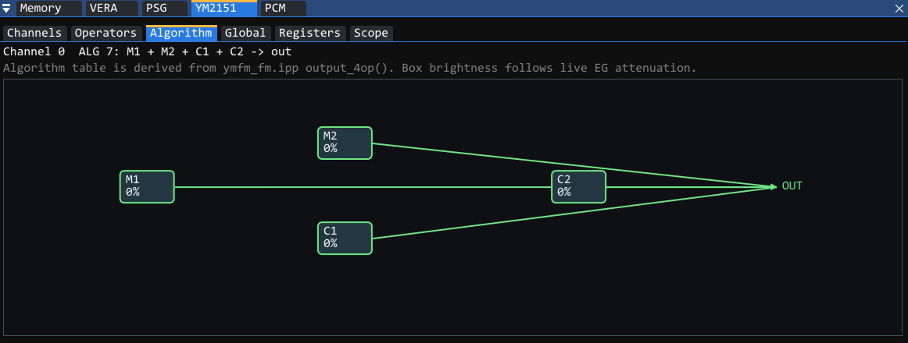

##### PCM — the audio FIFO

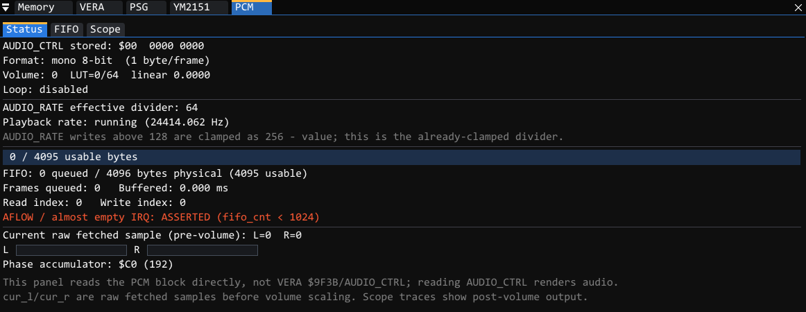

The audio FIFO is the one sound source where the CPU has to keep up, so this panel is mostly about
whether it is: FIFO fill level as a bar and a byte count, how many frames that is in milliseconds,
read and write indices, and whether the `AFLOW` interrupt is currently asserted. Format, volume and
playback rate are decoded from `AUDIO_CTRL` and `AUDIO_RATE`, and the panel reads the PCM block
directly rather than through `$9F3B`, so inspecting it does not itself consume audio.

#### Watching I/O and file access

The **I/O** panel covers the ports: everything in `$9F00`–`$9FFF`, plus the devices that hang off
them. Its **Activity** tab is a rolling log rather than a state dump, because I/O is a
conversation — a command goes out, a status comes back — and a snapshot taken between commands
tells you nothing. Each row names the register it touched (`DATA0`, `T1C_L`, `SPI_CTRL`) and
explains it on hover, so you are not looking up addresses in a manual while you debug.

**Capture is off by default, and so is every device.** It is the one debugger feature the running
machine pays for — a test and a branch on every I/O access — and the I/O page is the busiest
address range in the system. Turn it on, then tick only what you are actually looking for. Each
device's checkbox says what it captures, what it tells you that its own tab does not, and roughly
how fast it produces events: VERA's data ports alone are thousands of accesses per frame, and I2C
and the joysticks are polled around sixty times a second whether or not anything happens. The SD
card's data path at `$9F3E`/`$9F3F` is captured separately as **SPI** so it survives VERA being
off.

Every other tab works with capture off — they read live device state, not the log.

##### Two ways to reach a file, and only one of them has names

This is the thing worth knowing before you go looking for a filename and cannot find it.

| | When | What you see |
| --- | --- | --- |
| **Host filesystem** | the default, no SD image attached | Real filenames. The emulator intercepts the KERNAL's IEEE calls, so it knows the name, the channel, the direction and the byte counts. |
| **SD card image** | `-sdcard <image>` | **Blocks only.** The ROM's own FAT driver runs inside the emulated machine and talks to the card over SPI. The emulator sees `CMD17`, an LBA and 512 bytes — never a name. |

They are mutually exclusive by default: `-sdcard` turns host-filesystem access off unless you also
pass `-hostfsdev`. `-fsroot` sets the host directory the machine sees — it does **not** attach a
card, so with `-fsroot` alone the SD tabs are legitimately empty and say so.

The **Files** tab shows both, in separate sub-tabs, so it is always clear which one is in play.

Its host-filesystem half keeps an always-on **history** of opens, closes, directory listings, DOS
commands and the status each produced. That history is the point: a file operation erases itself
when it completes, so a list of *currently open* channels is empty almost all the time, and a
directory listing or a failed open would otherwise flash past unseen. The history is kept whether
or not capture is on, because file operations are rare enough to record for free.

For the SD image, ADD closes the gap by parsing the filesystem *itself*: **Build index** reads the
image's partition table, BPB, FATs and directory tree — including long filenames — and maps every
cluster back to a path. Block traffic then resolves to `/GAMES/FOO.PRG + 2048`, and the file list
shows how many bytes of each file the machine has actually read or written this session, listing
the files it touched first so they stand out from the ones that merely exist.

The index is a snapshot, not a live view. If the machine writes to a FAT or a directory the index
is marked **STALE** and you rebuild it by hand. That is deliberate: quietly serving a filename
that has since become wrong would be worse than admitting the index has aged.

### Source-level debugging with cc65

Build with debug info, and the emulator will show you your own source instead of raw disassembly.

Build, in assembly:

```
ca65 --debug-info -o myprog.o myprog.s
ld65 -C myprog.cfg --dbgfile myprog.dbg -o myprog.prg myprog.o
```

Build, in C:

```
cl65 -t cx16 -g -Wl --dbgfile,myprog.dbg -o myprog.prg myprog.c
```

Run:

```
x16emu -imgui -prg myprog.prg -run -dbgfile myprog.dbg -srcpath ./src
```

There are two ways a `.dbg` gets loaded:

* `-dbgfile <file.dbg>` loads one explicitly at start-up.
* Whenever the machine loads a program from the host filesystem — `-prg`, a BASIC `LOAD`, or a DOS
  shortcut like `/PROG.PRG` — the `.dbg` sitting beside it is merged automatically. The rule is
  simply to swap the extension: `myprog.prg` → `myprog.dbg`. Debug info describing the address
  range being replaced is dropped first, so an overlay loading over another module takes over its
  addresses, and swapping the first one back restores it.

Runtime loading follows the debugger: it happens whenever the debugger is enabled. `-no-dbgauto`
turns it off, and `-dbgauto` forces it on without the debugger. It is worth turning off for
software you do not trust, because the file being read is chosen by the emulated program, and a
`.dbg` can name source paths anywhere on the host.

Two limits are worth knowing. Loads that do not use the KERNAL's block-transfer path are not
noticed — `VERIFY`, loading into VRAM, and loading into `$9D00`–`$9FFF` all fall back to
byte-at-a-time reads. And editing a `.dbg` while the emulator is running has no effect, because
each file is merged once; restart the emulator after a rebuild.

Because a `.dbg` only records source *file names*, the emulator locates the actual `.s`/`.c` files
by searching, in order: the path stored in the `.dbg`, the directory of the `.dbg`, each
`-srcpath <dir>` you passed (most recent first), the directory of the loaded program, and finally
the current directory.

**C programs show the C.** cc65 compiles `myprog.c` to `myprog.s` and assembles that, and
with `-g` the `.dbg` describes the same bytes twice: once against your C statements and once
against the generated assembly, instruction by instruction. The debugger prefers the C, so the
Source panel follows your `.c` file and breakpoints set on a `.c` line land at the start of that
statement. The generated `.s` is left out of the source panel's **Open…** list, since `cl65`
deletes it on the way out; a `.s` you wrote yourself is still offered, and so is one you kept.
The disassembly is unaffected — it still aligns on the real instruction boundaries.

Stepping runs a whole C statement per press. F10 steps over a call — `printf(...)` and
everything it does is one press — and F11 steps into one, landing on the first line of the
function. Both fall back to stepping one instruction at a time when the debug info has no C in
it, so assembly projects step exactly as they always did; the Source panel has a **Step by
line** toggle if you want the instruction-at-a-time behaviour for C too. The Disassembly panel
is unaffected either way.

What you do *not* get for C yet is data: locals, parameters and watch expressions still have to
be read as raw memory, because nothing here decodes cc65's software stack or its type records.
Globals work, as they are ordinary labels.

**Banked code is partly handled.** A `.dbg` does not record which RAM bank a `$A000`–`$BFFF`
segment belongs to. When the running machine loads a program, the emulator notes which RAM bank was
mapped as the first byte landed, and associates that bank with the segment — but only when the
load's start address and size identify exactly one segment. A file containing several segments, or
one whose size does not match a segment, leaves those segments bank-unknown. Nothing consumes that
association yet; it is recorded for the debugger front-ends still to come.

### Remote debugging with DAP

`-debugport [<port>]` starts a [Debug Adapter Protocol](https://microsoft.github.io/debug-adapter-protocol/)
server over TCP, on port **9009** by default, so an IDE such as VS Code or Visual Studio can
attach for source-level debugging. It speaks standard `Content-Length`-framed JSON, so any
compliant DAP client works.

```
x16emu -debugport -prg myprog.prg -run -dbgfile myprog.dbg -srcpath ./src
x16emu -debugport 4711 ...           # pick your own port
x16emu -debugport -imgui ...         # attach an IDE and watch the panels at the same time
```

The emulator runs immediately on launch; it does not auto-pause waiting for a client.

A minimal VS Code attach configuration looks like this — note that the `type` value depends on
which DAP extension you wire it up to, as no editor extension is bundled with the emulator:

```json
{
  "version": "0.2.0",
  "configurations": [
    {
      "name": "Attach to X16 Emulator",
      "request": "attach",
      "type": "x16",
      "host": "localhost",
      "port": 9009
    }
  ]
}
```

#### What the server supports

Standard requests: `initialize`, `launch`, `attach`, `configurationDone`, `threads`, `stackTrace`,
`scopes`, `variables`, `setVariable`, `setBreakpoints`, `setFunctionBreakpoints`,
`setInstructionBreakpoints`, `setDataBreakpoints`, `setExceptionBreakpoints`, `breakpointLocations`,
`continue`, `next`, `stepIn`, `stepOut`, `pause`, `goto`, `gotoTargets`, `stepInTargets`,
`evaluate`, `readMemory`, `writeMemory`, `disassemble`, `loadedSources`, `source`, `restart`,
`disconnect` and `terminate`.

Four scopes are exposed on every stack frame: **Registers** (including the 65C816 extras and the
current RAM/ROM bank), **Virtual Registers** (R0–R15), **Zero Page** and **Stack**. Memory reads
and writes use 24-bit addresses, so the high byte selects the 65C816 program bank on a GS machine.

#### Conditional breakpoints

Put a condition string on a breakpoint in `setBreakpoints`. Terms are joined with `&&`.

* **Pin to a bank:** `bank == 2`, `bank 2`, `rombank == 3`. Decimal or `$XX`/`0xXX`.
* **Test a value:** operands `A`, `X`, `Y`, `SP`, `P`, `byte[$ADDR]`, `word[$ADDR]`, or a bare
  `$ADDR` (which means `byte[$ADDR]`). Operators `==`, `!=`, `<`, `<=`, `>`, `>=`.

```
A == $05
byte[$1234] != 0
word[$0002] >= $0100
bank == 0 && byte[$1234] != 0
```

A `hitCondition` of `"5"` stops on the fifth hit.

#### Expressions you can evaluate

These work in a watch or REPL window, in addition to plain registers and addresses:

| Expression | Result |
| --- | --- |
| `$C000`, `$01C000`, `0xC000` | The byte at that CPU address (24-bit; high byte is the 65C816 bank) |
| `A`, `X`, `Y`, `SP`, `PC`, `P` | Register values, sized for the current CPU mode |
| `regs_all` | A one-line summary of every register |
| `vram ADDR [COUNT]` | VERA VRAM bytes, from a 17-bit hex address |
| `vera_reg` | All 32 VERA registers |
| `vera_line LINE` | The layer registers that actually rendered that display scanline — the way to catch a raster split |
| `bp_add ADDR`, `bp_remove ADDR`, `bp_list`, `bp_clear` | Manage breakpoints |
| `watch_add ADDR [LEN]`, `watch_remove ADDR`, `watch_list`, `watch_clear` | Manage write watchpoints |
| `reset` | Reset the machine |

cc65 labels and equates from a loaded `.dbg` resolve too.

#### Scripting input for automated tests

Three custom requests let a script drive the machine, which is what makes automated regression
runs of a game practical:

| Command | Arguments | Effect |
| --- | --- | --- |
| `x16/sendKey` | `key` (SDL key name like `"Return"`/`"A"`/`"Left"`, or a numeric scancode), `action` (`"press"` (default), `"down"`, `"up"`), optional `modifiers` (array of key names held around the key) | Injects a key event through the same path as a physical key press. |
| `x16/type` | `text` (string) | Types a string into the KERNAL keyboard buffer, like a clipboard paste. Ideal for BASIC lines and filenames; supports the `\Xnn` hex escape. |
| `x16/joystick` | `index` (slot 0–3), `buttons` (array of `up`, `down`, `left`, `right`, `a`, `b`, `x`, `y`, `start`, `select`, `l`, `r`), optional `mask` (raw 16-bit active-low), `enabled` (set `false` to release the slot back to a physical controller) | Holds or releases a virtual SNES controller. Buttons not listed are released. |

There is also `x16/registers`, which returns the full CPU, KERNAL and VERA state as JSON in one call.

#### x16dbg, the bundled command-line client

`tools/x16dbg` is a small .NET 8 console DAP client, useful for poking at a running emulator
without an IDE and for scripting.

```
dotnet run --project tools/x16dbg                       # interactive
dotnet run --project tools/x16dbg -- mem 1030-1040      # one-shot
dotnet run --project tools/x16dbg -- -host 127.0.0.1 -port 9009
```

Options are `-host <ip>` (default `127.0.0.1`), `-port <port>` (default `9009`), `-i` to force
interactive mode, and `-h` for help. With no command it drops into an interactive prompt.

Commands, in both modes: `step`/`s`, `continue`/`c`, `break`/`b`, `status`/`t`, `reset`,
`regs`/`r`, `setreg <reg> <hexval>`, `mem <addr>-<end>` or `mem <addr> <len>`,
`setmem <addr> <hexdata>`, and `bp add|remove|list|clear <addr>`. Addresses are hex.

```
> b
! STOPPED (pause)
  PC=$C1C6  A=$02 (  2)  X=$FF (255)  Y=$0A ( 10)
  SP=$F0  P=$24 [--B-DI--]  RAM Bank=$00  ROM Bank=$00
> bp add 080D
> mem C000-C00F
  C000: A9 00 85 00 A9 01 85 01 A9 00 8D 00 02 A9 00 8D  |................|
> c
```

Web Site
--------

Commander X16: [https://commanderx16.com](https://commanderx16.com)

X16Emu ADD: [https://github.com/xylothan/x16-emulator](https://github.com/xylothan/x16-emulator)


License
-------

Copyright (c) 2019-2023 Michael Steil &lt;mist64@mac.com&gt;, [www.pagetable.com](https://www.pagetable.com/), et al.
All rights reserved. License: 2-clause BSD

ADD's additions are released under the same 2-clause BSD license. Dear ImGui is vendored in
`src/extern/imgui/` under its own MIT license.


Release Notes
-------------
See [RELEASES.md](RELEASES.md) for what each ADD build adds. The release notes for the upstream
emulator each build is based on are [published upstream][upstream-releases].


<!-------------------------------------------------------------------->
[dev-release]: https://github.com/xylothan/x16-emulator/releases/tag/dev
[releases]: https://github.com/xylothan/x16-emulator/releases
[upstream]: https://github.com/X16Community/x16-emulator
[upstream-readme]: https://github.com/X16Community/x16-emulator#readme
[upstream-releases]: https://github.com/X16Community/x16-emulator/releases
[webassembly]: https://github.com/xylothan/x16-emulator/blob/main/webassembly/WebAssembly.md
[x16docs]: https://github.com/X16Community/x16-docs
[x16rom-build]: https://github.com/X16Community/x16-rom#releases-and-building
[x16rom]: https://github.com/X16Community/x16-rom
[website]: https://commanderx16.com

<!-- For PDF formatting -->
<div class="page-break"></div>
